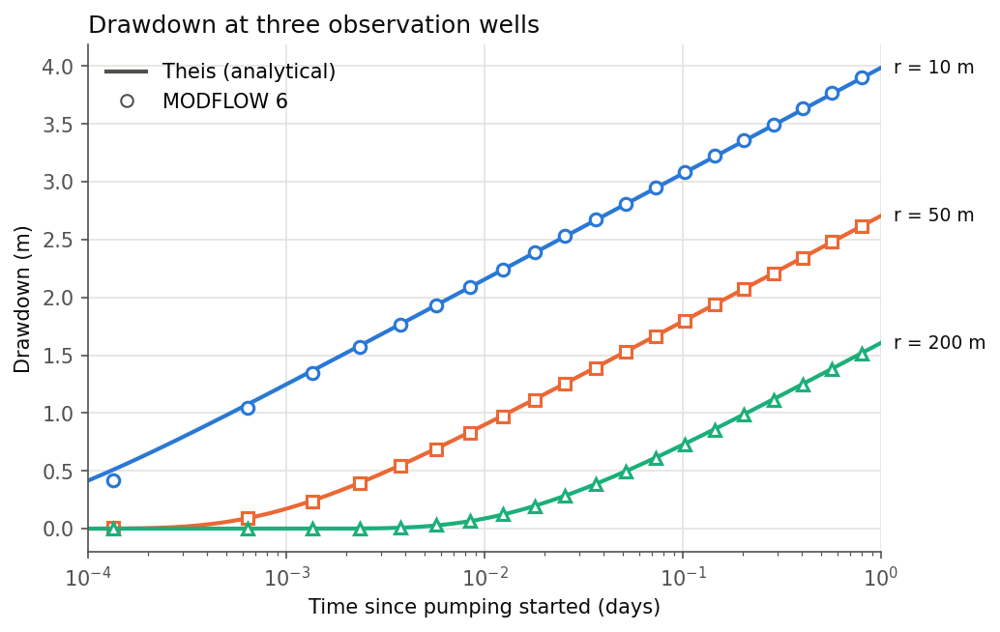
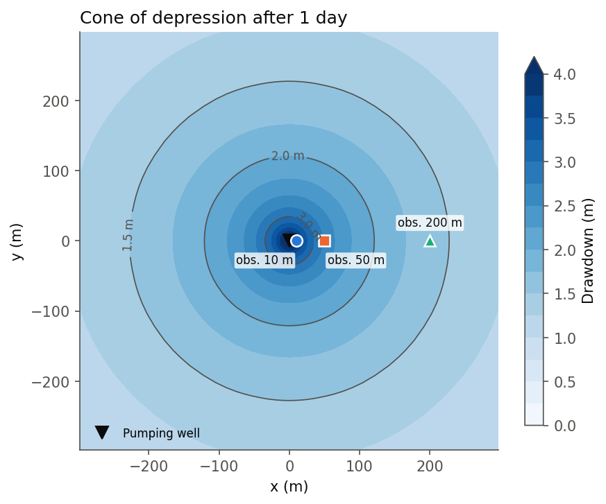
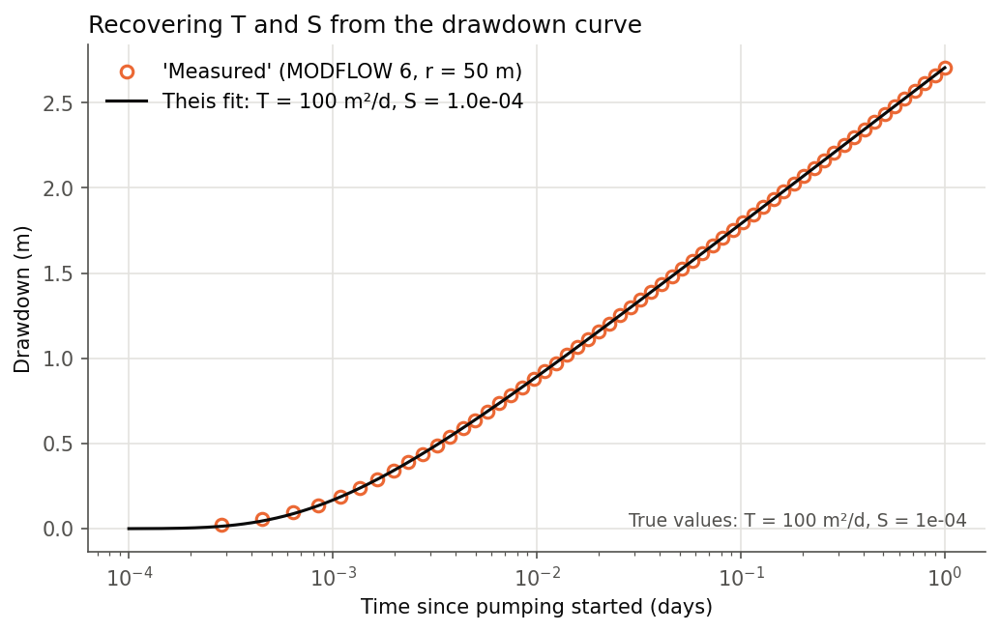

# 01 · Pumping test: MODFLOW 6 vs. the Theis solution

A well pumps a confined aquifer at a constant rate for one day. The growing
cone of depression is simulated with **MODFLOW 6** and checked against the
**Theis (1935)** analytical solution. The simulated drawdown is then treated
like field data: fitting Theis to it should recover the aquifer
transmissivity *T* and storativity *S*.



## Problem set-up

| Parameter | Value |
|---|---|
| Hydraulic conductivity *K* | 10 m/d |
| Aquifer thickness *b* | 10 m (confined) |
| Transmissivity *T = K·b* | 100 m²/d |
| Storativity *S* | 1 × 10⁻⁴ |
| Pumping rate *Q* | 500 m³/d |
| Duration | 1 day (60 time steps, growing ×1.12) |
| Observation wells | 10 m, 50 m, 200 m from the pumping well |

**Grid design.** Theis assumes an infinite aquifer, so the model boundary has to be far enough away that
the cone never reaches it. I used a *telescoping* grid of 107 × 107 cells: 2 m cells at the well,
each cell 15 % larger than the previous one, and fixed-head boundaries 20 km away.
That keeps the model small but accurate close to the well.

**MODFLOW 6 packages:** `DIS` (variable cell sizes), `NPF` (confined), `STO` (transient storage),
`CHD` (far-field boundary), `WEL` (pumping well), `OC`.

## Results

| Distance | Max. difference, model vs. Theis |
|---|---|
| 10 m | 9 cm (from the grid near the well; see below) |
| 50 m | 1 cm |
| 200 m | 0.5 cm |

**Inverse analysis** (Theis curve fit to the 50 m well with `scipy.optimize.curve_fit`):

| | True | Recovered | Error |
|---|---|---|---|
| *T* (m²/d) | 100 | 99.7 | −0.3 % |
| *S* (–) | 1.0 × 10⁻⁴ | 1.02 × 10⁻⁴ | +1.9 % |




## What I learned

- A numerical model can be *verified* by comparing it with an analytical solution for a simple case.
  This is standard practice before trusting it on a real site.
- The largest error is closest to the well. MODFLOW spreads the well over a whole 2 m cell, while Theis
  assumes an infinitely thin well.
- The fitted parameters come out almost exactly right, which confirms that the transient storage
  (`STO`, *Ss = S/b*) is set up correctly.

## Run it

```bash
python theis_pumping_test.py
```

The script writes the MODFLOW files to `model/`, runs them, and saves the figures in `figures/`.
It takes about 10 seconds.
