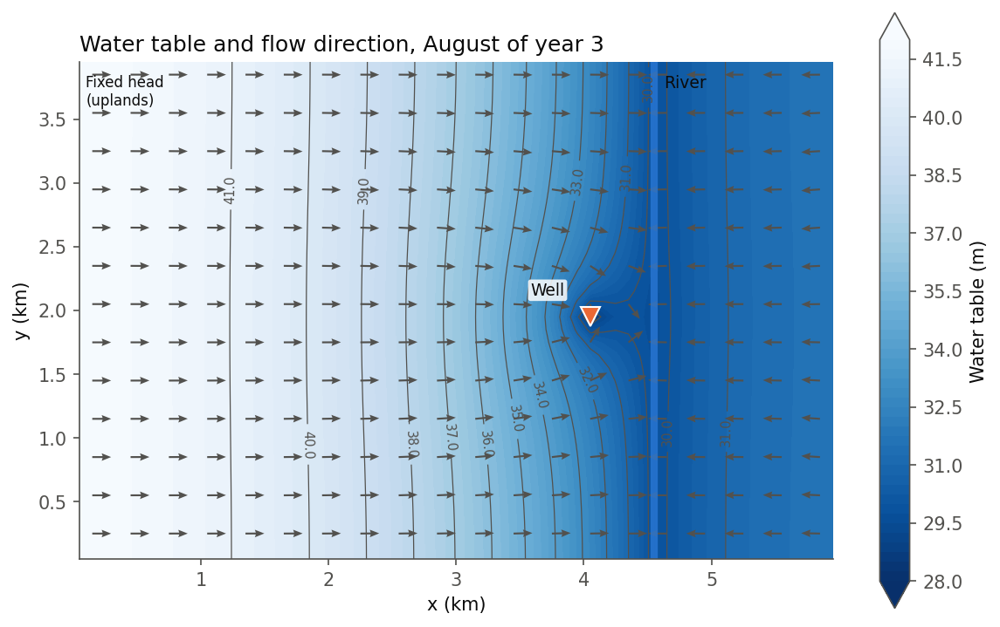
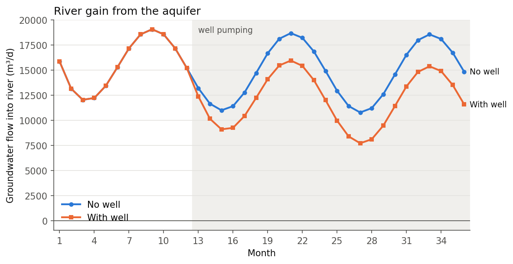
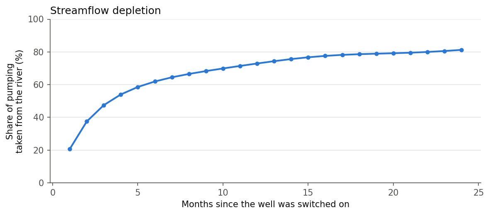

# 02 · River–aquifer interaction and streamflow depletion

A river crosses an unconfined sand-and-gravel aquifer. Groundwater flows from the uplands toward
the river and feeds it (a *gaining* river). River stage and rain recharge change with the seasons.
At the start of year 2, a water-supply well is switched on **500 m from the river**.

**Question:** how much of the water the well pumps is actually taken from the river?
This is known as *streamflow depletion*, and it is central to how many water authorities issue
groundwater permits.



## Problem set-up

| Item | Value |
|---|---|
| Domain | 6 km × 4 km, 100 m cells, 1 unconfined layer |
| *K* / specific yield | 15 m/d / 0.15 |
| Upland boundary | fixed head 42 m (west edge) |
| River | north–south at x = 4.55 km; stage 29–31 m (peaks in April) |
| Riverbed conductance | 2000 m²/d per cell |
| Recharge | 0–1.2 mm/d, seasonal (wet winter, dry summer) |
| Well | 4000 m³/d, switched on at month 13 |
| Time | 1 steady-state period, then 36 monthly periods |

**MODFLOW 6 packages:** `DIS`, `NPF` (unconfined, Newton solver), `STO` (specific yield),
`CHD`, `RIV` (monthly stage), `RCH` (monthly recharge), `WEL`, `OC`.

**Method:** the same model is run twice, **with and without the well**. The difference in
river–aquifer exchange between the two runs is the streamflow depletion caused by the well alone.
Comparing two runs like this removes the seasonal signal, which is much larger than the effect of the well.

## Results



- Without the well, the river gains on average **~15 000 m³/d** from the aquifer. The gain is lowest
  in spring, when the river is high.
- With the well pumping 4000 m³/d, the river's gain drops more and more over time. In year 3 the
  river receives about **3100 m³/d less** than without the well.



- Depletion builds up over time: **20 %** of the pumping after the first month, **~60 %** after
  6 months, and **~80 %** by the end of year 3.
- In the long run, almost all of the pumped water is "captured" from the river rather than
  from aquifer storage. A well near a river mainly pumps river water with a delay.

## What I learned

- How to drive a model with time-varying stresses (`RIV` stage and `RCH` for every stress period).
- How to read the cell-by-cell budget (`RIV` flows) with FloPy, and how to plot flow directions from
  the specific discharge.
- Why comparing two scenarios is a much cleaner way to isolate the effect of one change than
  looking at a single run.

## Run it

```bash
python river_aquifer.py
```

It runs both scenarios (about 20 seconds) and writes the figures to `figures/`.
