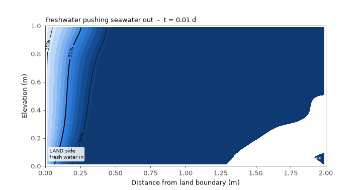
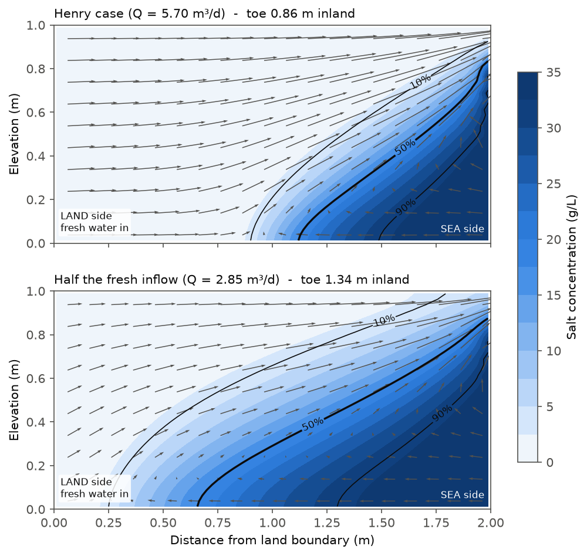
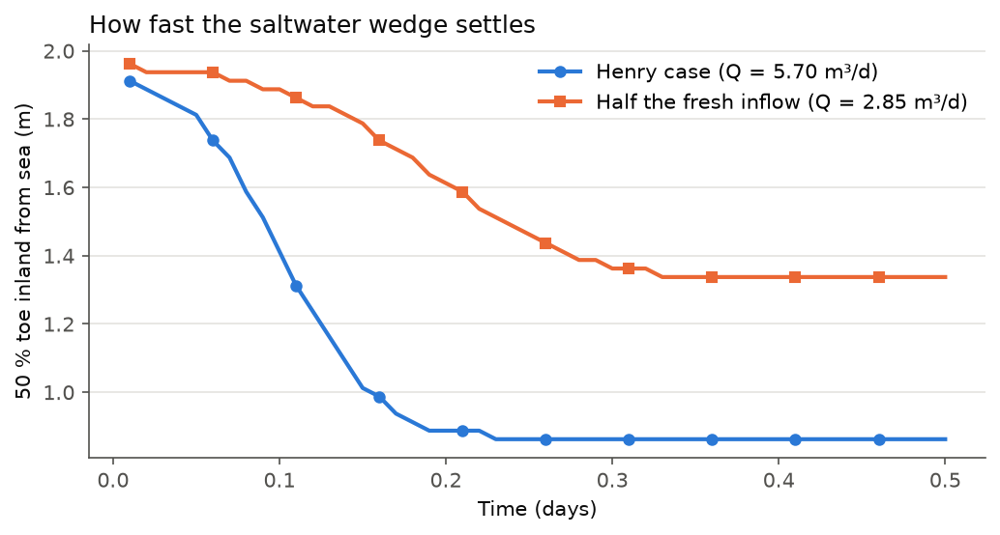

# 03 · Seawater intrusion: the Henry problem

In coastal aquifers, fresh groundwater flows out to the sea, while the heavier seawater
(1025 kg/m³ vs 1000 kg/m³) pushes in underneath it and forms a **saltwater wedge**.
If the fresh-water flow is reduced (by over-pumping or drought), the wedge moves inland and
can reach water-supply wells.

This project reproduces the classic **Henry (1964)** benchmark with MODFLOW 6. It then asks a
management question: *what happens if the fresh-water inflow is halved?*



## Problem set-up

A vertical cross-section, 2 m long and 1 m deep, with 80 × 40 cells of 2.5 cm.

| Parameter | Value |
|---|---|
| *K* | 864 m/d |
| Porosity | 0.35 |
| Diffusion coefficient | 0.57 m²/d |
| Fresh-water inflow (land side) | 5.70 m³/d per m of coast (Henry), and 2.85 m³/d |
| Seawater | 35 g/L, 1024.5 kg/m³ |
| Time | 0.5 days, 500 steps (starting from an aquifer full of seawater) |

**Why this model is harder:** flow and salt transport are coupled *in both directions*. The flow
carries the salt, and the salt changes the water density, which changes the flow. MODFLOW 6
handles this with the **`BUY` (buoyancy) package**, which links the flow model (`GWF`) and the
transport model (`GWT`).

**MODFLOW 6 packages:**

- **GWF:** `DIS`, `NPF`, `BUY`, `WEL` (fresh inflow), `CHD` (sea, with `CONCENTRATION` and
  `DENSITY` auxiliary variables)
- **GWT:** `ADV` (TVD scheme), `DSP`, `MST`, `SSM`, and the `GWF6-GWT6` exchange

## Results



| Scenario | 50 % seawater line at the aquifer bottom |
|---|---|
| Henry case (Q = 5.70 m³/d) | **0.86 m** inland from the sea |
| Half the fresh inflow (Q = 2.85 m³/d) | **1.34 m** inland from the sea |

- Halving the fresh-water inflow moves the wedge toe **56 % further inland**.
- The arrows show the typical *circulation cell*: seawater flows in along the bottom, mixes, rises,
  and returns to the sea with the fresh water near the top.



- The wedge reaches its equilibrium position within about 0.25–0.35 days in this small model.
  With less fresh water, it settles more slowly.

## What I learned

- How to set up **density-dependent flow** in MODFLOW 6 (`BUY` package, auxiliary `DENSITY`
  on the boundary).
- How to link boundary concentrations to transport through `SSM` with auxiliary variables.
- How to post-process transport results into physically meaningful quantities: isochlors and
  the position of the wedge toe.
- How to make an animation from saved time steps with `matplotlib.animation`.

## Run it

```bash
python henry_saltwater.py
```

It runs both scenarios (about 1 minute) and writes the figures and the GIF to `figures/`.

*Reference:* Henry, H.R. (1964). Effects of dispersion on salt encroachment in coastal aquifers.
USGS Water-Supply Paper 1613-C. The parameters follow the MODFLOW 6 example `ex-gwt-henry`.
